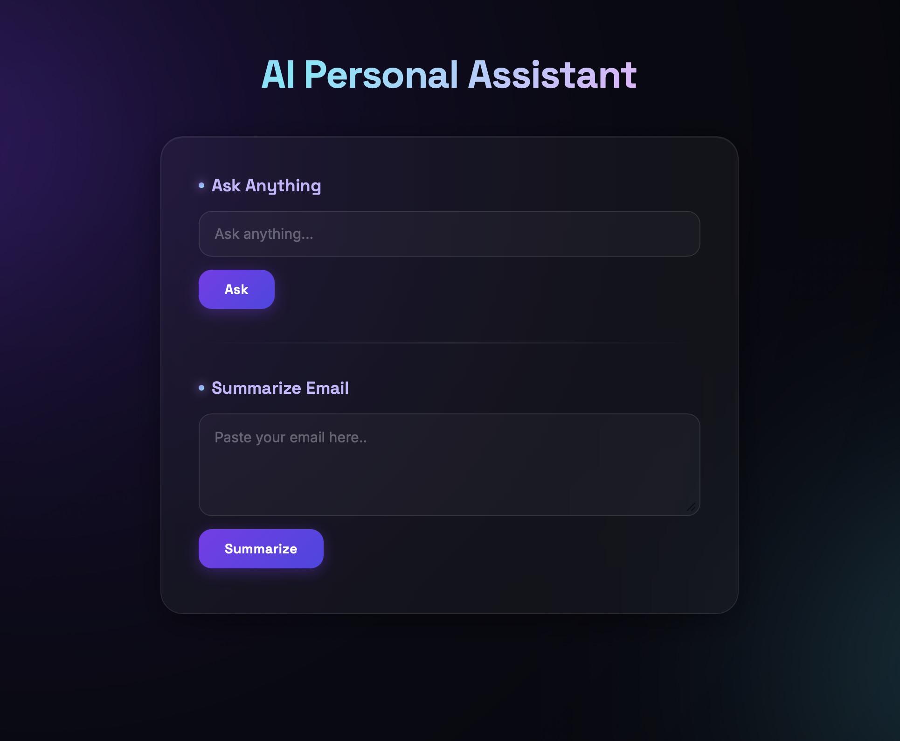

# AI Personal Assistant

A lightweight Flask web app that acts as a personal AI assistant — ask it anything or paste in an email to get a quick summary, powered by the OpenAI API.

<div align="center">
   
  <p><em>AI Personal Assistant ✨</em></p>
</div>

## Features

- **Ask Anything** — Type any question and get an instant AI-generated answer.
- **Summarize Email** — Paste a long email and get a concise 2–3 sentence summary.
- Clean, dark glassmorphic UI with smooth loading states.
- Simple Flask backend with two REST-style JSON endpoints.

## Tech Stack

- **Backend:** Python, Flask
- **AI:** OpenAI API (`gpt-5.4`)
- **Frontend:** HTML, CSS, vanilla JavaScript
- **Config:** python-dotenv for environment variables

## Project Structure

```
AI-Assistant/
├── main.py              # Flask app & OpenAI API routes
├── requirements.txt      # Python dependencies
├── static/
│   └── style.css          # UI styling
├── templates/
│   └── index.html         # Main page
└── .gitignore
```

## Getting Started

### Prerequisites

- Python 3.8+
- An [OpenAI API key](https://platform.openai.com/api-keys)

### Installation

1. Clone the repository
   ```bash
   git clone https://github.com/ravihw7/AI-Assistant.git
   cd AI-Assistant
   ```

2. Create a virtual environment (recommended)
   ```bash
   python -m venv venv
   source venv/bin/activate   # On Windows: venv\Scripts\activate
   ```

3. Install dependencies
   ```bash
   pip install -r requirements.txt
   ```

4. Set up environment variables

   Create a `.env` file in the project root:
   ```
   API_Key_openAI=your_openai_api_key_here
   ```

5. Run the app
   ```bash
   python main.py
   ```

6. Open your browser and go to `http://127.0.0.1:5000`

## API Endpoints

| Endpoint      | Method | Body Param | Description                          |
|---------------|--------|------------|---------------------------------------|
| `/`           | GET    | —          | Renders the main UI                   |
| `/ask`        | POST   | `question` | Returns an AI-generated answer        |
| `/summarize`  | POST   | `email`    | Returns a 2–3 sentence email summary  |

Both endpoints return JSON in the form:
```json
{ "response": "..." }
```

## Roadmap

- [ ] Add conversation history / context
- [ ] Support file uploads for summarization
- [ ] Add authentication for multi-user support
- [ ] Deploy to a cloud platform (Render / Railway / Vercel)

## License

This project currently has no license specified. Feel free to reach out to the author for usage permissions.

## Author

**Ravi** — [@ravihw7](https://github.com/ravihw7)
